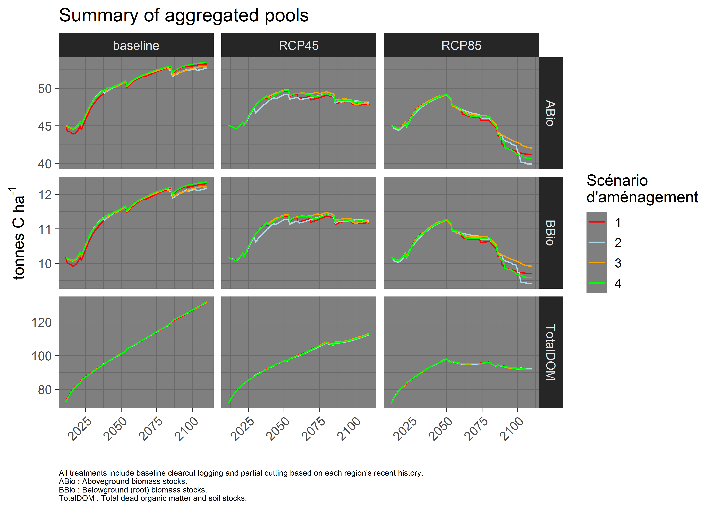
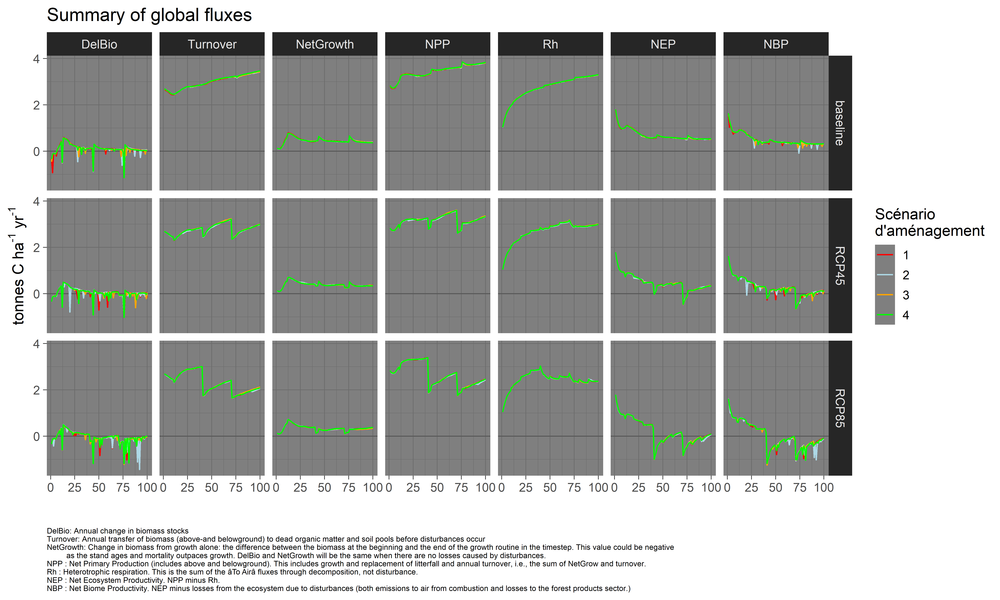
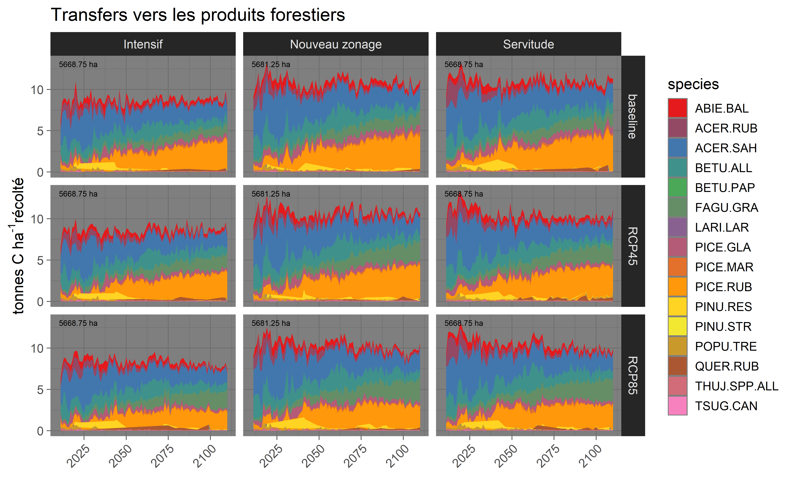
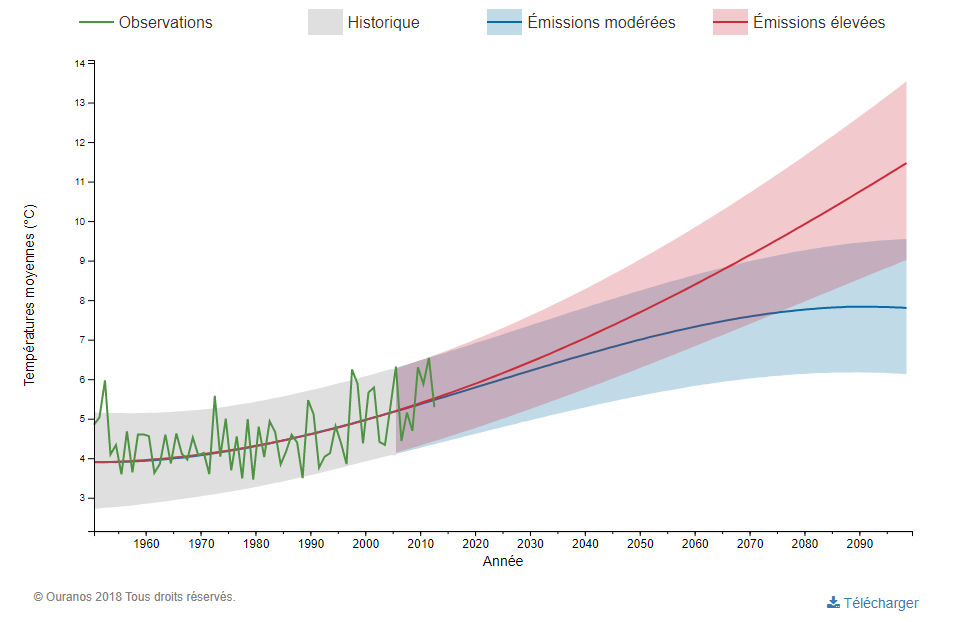

Updated on oct. 18 2019

-------

### General description

This repository contains input files, documentation and compiled simulation outputs (preliminary results).

-----------

-----------  

   

-----------  

### Projected mean temperature - Forêt Hereford

